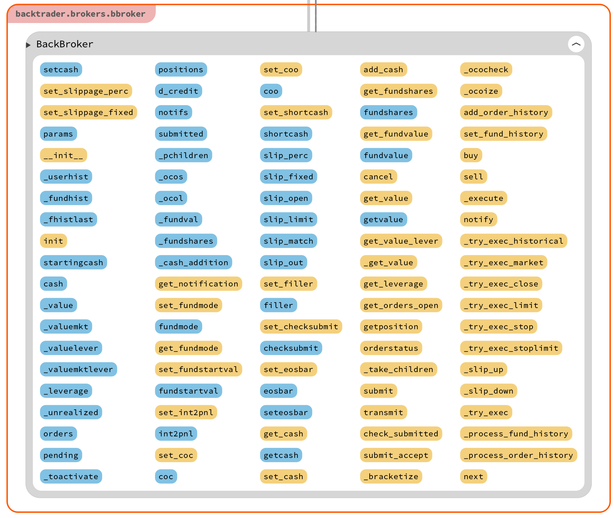

# 1. BackTrader 简介
## 1.1 BackTrader 量化软件特点

BackTrader是一个源自欧洲的工业级专业量化软件， 也是目前金融行业应用最广的量化分析软件。

目前， 很多国际上的一线金融机构， 都在实盘领域使用BackTrader量化软件进行日常的投资交易。

在 BackTrader官方网站， 有专门的文档介绍该软件的特点， 如下：
- 使用Python语言开发
- 结构自然。
- 内置大量指标， 包括全套TA-Lib金融指标库。
- 内置专业级分析模块， 包括夏普指数、 回报率、 最大回撤等。
- 便于用户自行扩展。
- 支持Pandas矢量化高速运算。
- 支持多数据源。
- 独立Broker经纪人模块、 便于设置交易参数等。
- 支持实盘交易， 内置全球多个交易所的数据、 交易接口。
- 支持多周期数据， 可以是Tick数据， 也可以是分时数据、 日线数据。
- 支持多策略组合。 系统有两种操作模式， 即传统策略编程模式和买卖点信号模式， 可设置信号权重、 多组交易信号叠加。
- 内置专业图表绘制模块， 支持可视化数据分析。

BackTrader系统功能非常强大， 其系统架构设计非常合理， 用户可以根据自身需要自行扩展使用。


## 1.2 模块介绍


量化就是数据加策略：

```量化（Quant） = 数据（Data） +策略（Strategy）```


# 2. 数据预处理

## 2.1 数据格式

保存金融交易数据， 可以使用多种文件格式： 文本格式、 CSV格式、 数据库格式， 以及Pandas的DataFrame格式等。


需要注意的是， 这里所说的CSV格式是数据文件格式， 而OHLC（Open、High、Low、Close）格式是数据字段格式， 这两者是不同的。


BackTrader底层数据为了提高运算效率， 采用了特殊的内部格式，而不是标准的CSV格式和OHLC格式。


OHLC数据格式是金融行业的标准数据格式， OHLC是四个英文单词的缩写， 即Open、 High、 Low、 Close， 其中， Open为开盘价， High为最高价， Low为最低价， Close为收盘价。通常， OHLC数据格式包括时间/日期（time/date） 和成交量字段（vol） ， 有些还包括修正成交量字段（AdjClose） 。


在BackTrader量化程序中， OHLC是回测数据的核心要素之一。


## 2.2 Lines 内部数据格式

Lines在BackTrader中有特殊含义， 是一种基于时序的数据组链条，相当于Pandas中的Series数据列。一个Lines也被称作Lineseries， 相当于一组数据。下图所示的OHLC金融数据格式， 类似于Excel报表格式， 有Open、 Close等不同的字段。


上图中的每一列， 都相当于BackTrader的一个Lines数据组。为了提高运算效率， BackTrader底层数据采用了特殊的内部格式，这个特殊的数据格式就是Lines， 用于存储和传递内部数据流。


如下图所示，是Lines 数据类型的内部属性分布。以下画线“_”开头的函数是类内部函数， 可以无须考虑， 其他主要函数如下

- 常规操作函数： forward、 backwards、 rewind、 extend、 reset、home、 advance、 print、 next。

- 数据处理函数： size、 fullsize、 get、 buflen、 len、 getattr、setattr、 abs、 min、 max。
- 其他类函数和属性： lines、 zip、 pow、 eval、 issubclass、isinstance、 hasattr、 iter。


Lines具有一组数据， 并且在执行过程中会动态增长， 因此可以通过调用Python标准的Len函数或者Buflen函数， 随时测量Lines数据长度。len函数的返回值是： 已经处理了多少数据。buflen函数的返回值是： 数据总数。


# 3. 策略编程

## 3.1 SQN 指数&策略评估参数

量化交易有一套自己的评估指标参数的体系，用于考核量化策略的优劣。常用的评估量化策略的指标参数有：

- ROI：资产回报率。
- Starting Portfolio Value：起始资金。
- Final Portfolio Value：资产总值。
- Total Profit：利润总额。
- SharpeRatio：夏普指数。
- max_drawdown_len：最大回撤周期。
- max_drawdown：最大回撤。
- max_drawdown_money：最大回撤资金。


还有一个专业评估指数：SQN 指数，这是量化策略评判指数，可以用来衡量交易系统好坏的程度。SQN 指数全程为：System Quality Number，它也被称为“系统质量指数”，计算公式为：

``` SQN = (平均获利/标准差) x 年交易次数的平方根```

当交易数量≥30时， SQN指数通常被认为是可靠的。SQN指数评判量化系统的标准如下。
● SQN指数=1.6～1.9， 不怎么样， 可以凑合用。
● SQN指数=2.0～2.4， 普通。
● SQN指数=2.5～2.9， 好。
● SQN指数=3.0～5.0， 杰出。
● SQN指数=5.1～6.9， 一流。

● SQN指数=7.0以上， 极好。


## 3.2 量化金融指标

**量化策略**是量化交易的核心。在实盘操作中不缺策略，金融专业人士更关心指标。


BackTrader 量化软件中内置了 100 多种金融指标。另外，还内置有全套的 TA-Lib 金融指标模块，BackTrader 对 TA-Lib 金融指标模块进行了二次封装，TA-Lib 指标名称中通常会加上前缀“ta_”。


TA-Lib 金融指标库通常分为 6 组：

- Overlap Studies 重叠研究指标
- Momentum Indicators 动量指标
- Volume Indicators 成交量指标
- Volatility Indicators 波动率指标
- Price Transform 价格变动指标
- Cycle Indicators 周期指标

此外， TA-Lib指标库还包含数学辅助指标和一组K线图CDL形态指标， 但数学辅助指标很少直接用于量化分析。TA-Lib指标库当中的CDL形态指标函数， 名称都采用CDL字符开头， 大约有200多个， 都是关于K线图的形态函数。


BackTrader量化软件当中的指标函数， 都是采用标准化的函数接口模式。 每一个内置指标函数都非常标准， 包括指标函数名称、 输入、 输出参数， 以及绘图参数。在实盘操作中， 通过将金融指标进行组合， 再配合不同的参数， 可以衍生出成千上万的量化交易策略。BackTrader有专业的OPT参数优化工具， 只要用户设置好参数的上限和下限， 软件就会自动协助用户， 找到最优化的一个参数组合。


## 3.3 策略编程模板

下面看一组策略的基础代码，该案例是一套基础策略源码， 采用的是空策略。以下是案例主程序部分代码：

```python
import backtrader as bt
from backtrader import *
from datetime import datetime

# Create a subclass of Strategy to define the indicators and logic
class Strategy001(bt.Strategy):
    def __init__(self):
        self.dataclose = self.datas[0].close

    def log(self,txt,dt=None):
        # log记录函数。
        dt = dt or self.datas[0].datetime.date(0)
        print('%s, %s' % (dt.isoformat(),txt))

    def next(self):
        self.log('Close 收盘价，%.2f' % self.dataclose[0])

print('\n#1，设置 BT 量化回测程序入口')
cerebro = bt.Cerebro()  # create a "Cerebro" engine instance

print('\n#2，设置BT回测初始参数及策略')
print('\n\t#2-1，设置BT回测初始参数：起始资金等')
dmoney0 = 100000.0
cerebro.broker.setcash(dmoney0)
dcash0 = cerebro.broker.startingcash

print('\n\t#2-2，设置数据文件，需要按时间字段正序排序')
rs0 = os.path.abspath(os.path.dirname(__file__)) + '/../data/'
filename = '002046.SZ.csv'
fdat = rs0 + filename
print('\t@数据文件名：', fdat)

print('\t 设置数据BT回测运算：起始时间、结束时间')
print('\t 数据文件，可以是股票期货、外汇黄金、数字货币等交易数据')
print('\t 格式为：标准OHLC格式，可以是日线、分时数据')

t0stx,t9stx = datetime(2018, 1, 1),datetime(2018, 12, 31)
data = bt.feeds.YahooFinanceCSVData(dataname=fdat,
                                 fromdate=t0stx,
                                 todate=t9stx)
cerebro.adddata(data)  # Add the data feed


print('\n\t#2-3，添加BT量化回测程序，对应的策略参数')
cerebro.addstrategy(Strategy001)

print('\n#3，调用BT回测入口程序，开始执行run量化回测运算')
cerebro.run()

print('\n#4，完成BT量化回测运算')
dval9 = cerebro.broker.getvalue()
print('\t 起始资金Starting Portfolio Value:%.2f' % dcash0)
print('\t 资产总值Final Portfolio Value:%.2f' % dval9)

print('\n#5，绘制BT量化分析图形')
cerebro.plot()  # and plot it with a single command
```

案例代码运行结果如下图所示：


从上图运行结果可以看出， 因为本案例是空策略案例， 所以最上方的收益曲线没有波动， 看不到曲线的起伏。 收益曲线下面是买卖点示意图（也就是常说的买单/卖单），目前看该示意图为空白。 本案例输出的图就只有一个简单的个股价格曲线。 曲线图标是字符C， 即收盘价（Close） 的首字母缩写。


该程序的输入内容如下：

```
#1，设置 BT 量化回测程序入口

#2，设置BT回测初始参数及策略

        #2-1，设置BT回测初始参数：起始资金等

        #2-2，设置数据文件，需要按时间字段正序排序
        @数据文件名： /Users/abc/workspace/python/BackTraderDemo/src/../data/002046.SZ.csv
         设置数据BT回测运算：起始时间、结束时间
         数据文件，可以是股票期货、外汇黄金、数字货币等交易数据
         格式为：标准OHLC格式，可以是日线、分时数据

        #2-3，添加BT量化回测程序，对应的策略参数

#3，调用BT回测入口程序，开始执行run量化回测运算
2018-01-02, Close 收盘价，9.20
2018-01-03, Close 收盘价，9.23
2018-01-04, Close 收盘价，9.35
......
......
2018-12-27, Close 收盘价，6.07
2018-12-28, Close 收盘价，6.15

#4，完成BT量化回测运算
         起始资金Starting Portfolio Value:100000.00
         资产总值Final Portfolio Value:100000.00

#5，绘制BT量化分析图形
```


#  4. Buy 买入策略

买入策略编程的核心问题有两个：**设置买入价格**和**买卖时机**。最重要的是设置好价格点，因为系统会自动选择时间点。


Buy 买入函数的主要子模块库有：SingalStrategy、BuySell、BackBrocker 等。买入函数(buy())是 Strategy 类的成员函数。


next 策略执行函数是策略编程的核心，也是具体执行策略运算的代码。next 函数是当前时间节点的数据分析和策略执行函数，是一个按时间节点迭代模式调用的函数。


以下代码采用“三连跌”的买入策略，主要逻辑在 next() 函数中:

```python
import backtrader as bt
from backtrader import *
from datetime import datetime

# Create a subclass of Strategy to define the indicators and logic
class BuyStrategy(bt.Strategy):
    def __init__(self):
        self.dataclose = self.datas[0].close

    def log(self,txt,dt=None):
        # log记录函数。
        dt = dt or self.datas[0].datetime.date(0)
        print('%s, %s' % (dt.isoformat(),txt))

    def next(self):
        self.log('Close 收盘价，%.2f' % self.dataclose[0])

        #使用经典的"三连跌"买入策略
        if self.dataclose[0] < self.dataclose[-1]:
            #当前收盘价格，低于昨天（前一天，[-1])
            if self.dataclose[-1] < self.dataclose[-2]:
                #昨天的收盘价格（前一天，[-1]），低于前天（前两天，[-2]】
                #"三连跌"买入信号成立
                #BUY,BUY,BUY!!,买！买！买！使用默认参数交易：数量、佣金等
                self.log('设置买单BUY CREATE, %.2f' % self.dataclose[0])
                self.buy()

print('\n#1，设置 BT 量化回测程序入口')
cerebro = bt.Cerebro()  # create a "Cerebro" engine instance

print('\n#2，设置BT回测初始参数及策略')
print('\n\t#2-1，设置BT回测初始参数：起始资金等')
dmoney0 = 100000.0
cerebro.broker.setcash(dmoney0)
dcash0 = cerebro.broker.startingcash

print('\n\t#2-2，设置数据文件，需要按时间字段正序排序')
rs0 = os.path.abspath(os.path.dirname(__file__)) + '/../data/'
filename = '002046.SZ.csv'
fdat = rs0 + filename
print('\t@数据文件名：', fdat)

print('\t 设置数据BT回测运算：起始时间、结束时间')
print('\t 数据文件，可以是股票期货、外汇黄金、数字货币等交易数据')
print('\t 格式为：标准OHLC格式，可以是日线、分时数据')

t0stx,t9stx = datetime(2018, 1, 1),datetime(2018, 12, 31)
data = bt.feeds.YahooFinanceCSVData(dataname=fdat,
                                 fromdate=t0stx,
                                 todate=t9stx)
cerebro.adddata(data)  # Add the data feed


print('\n\t#2-3，添加BT量化回测程序，对应的策略参数')
cerebro.addstrategy(BuyStrategy)

print('\n#3，调用BT回测入口程序，开始执行run量化回测运算')
cerebro.run()

print('\n#4，完成BT量化回测运算')
dval9 = cerebro.broker.getvalue()
kret=(dval9-dcash0)/dcash0*100

print('\t 起始资金Starting Portfolio Value:%.2f' % dcash0)
print('\t 资产总值Final Portfolio Value:%.2f' % dval9)
print('\t ROI投资回报率Return on investment: %.2f %%' % kret)

print('\n#5，绘制BT量化分析图形')
print('\t 注意图形当中最上面的现金、资产曲线')
print('\t 注意图形当中的买点图标，以及对应的曲线波动')
cerebro.plot()  # and plot it with a single command
```


程序中的 `self.buy()` 买入操作默认买入一手。该函数很灵活，可以根据选项参数设置买入数额，或者根据持有量仓位/现金额度进行处理。程序输入内容为：

```

#1，设置 BT 量化回测程序入口

#2，设置BT回测初始参数及策略

        #2-1，设置BT回测初始参数：起始资金等

        #2-2，设置数据文件，需要按时间字段正序排序
        @数据文件名： /Users/abc/workspace/python/BackTraderDemo/src/../data/002046.SZ.csv
         设置数据BT回测运算：起始时间、结束时间
         数据文件，可以是股票期货、外汇黄金、数字货币等交易数据
         格式为：标准OHLC格式，可以是日线、分时数据

        #2-3，添加BT量化回测程序，对应的策略参数

#3，调用BT回测入口程序，开始执行run量化回测运算
2018-01-02, Close 收盘价，9.20
2018-01-03, Close 收盘价，9.23
2018-01-04, Close 收盘价，9.35
2018-01-05, Close 收盘价，9.28
2018-01-08, Close 收盘价，9.22
2018-01-08, 设置买单BUY CREATE, 9.22
......
......
2018-12-24, Close 收盘价，6.41
2018-12-25, Close 收盘价，6.23
2018-12-26, Close 收盘价，6.20
2018-12-26, 设置买单BUY CREATE, 6.20
2018-12-27, Close 收盘价，6.07
2018-12-27, 设置买单BUY CREATE, 6.07
2018-12-28, Close 收盘价，6.15

#4，完成BT量化回测运算
         起始资金Starting Portfolio Value:100000.00
         资产总值Final Portfolio Value:99926.09
         ROI投资回报率Return on investment: -0.07 %

#5，绘制BT量化分析图形
         注意图形当中最上面的现金、资产曲线
         注意图形当中的买点图标，以及对应的曲线波动
```


生成的买入策略分析图如下所示：


最上方的蓝色曲线是资产总额，包括股票和持有现金总额，资产总额曲线可以反映用户买卖的盈亏情况。图中价格曲线附近的绿色三角符号就是股票的实际交易买入点。


# 5. Sell 卖出策略

## 5.1 Position 仓位检查

相对于买入策略而言， 卖出策略多了一个步骤：**仓位检查**。 这一设置是合理的， 因为大家首先要持有股票， 然后才能够卖出。在BackTrader量化程序中， 有专门的 position（仓位管理） 函数。


案例当中的 `next` 函数代码如下：

```python
    def next(self):
        self.log('Close 收盘价，%.2f' % self.dataclose[0])

        # 检查订单执行情况，默认每次只能执行一张 order 订单交易
        # 可以修改相关参数进行调整
        if self.order:
            return

        # 检查当前股票的仓位 position
        if not self.position:
            # 如果股票仓位为 0，则可以进行买入操作
            # 这个仓位设置模式，也可以修改相关参数进行调整
            # 使用经典的"三连跌"买入策略
            if self.dataclose[0] < self.dataclose[-1]:
                # 当前收盘价格，低于昨天（前一天，[-1])
                if self.dataclose[-1] < self.dataclose[-2]:
                    # 昨天的收盘价格（前一天，[-1]），低于前天（前两天，[-2]】
                    # "三连跌"买入信号成立
                    # BUY,BUY,BUY!!,买！买！买！使用默认参数交易：数量、佣金等
                    self.log('设置买单BUY CREATE, %.2f' % self.dataclose[0])
                    # 采用 track 模式设置 order 订单，回避第二张订单 2nd order 连续交易问题
                    self.order = self.buy()
        else:
            # 如果股票仓位 >0，则可以进行卖出操作，这个仓位设置模式，也可以修改相关参数进行调整
            # 此处使用经验参数：
            #   前一个订单，执行完成 bar_executed 5 个周期后才能进行卖出操作
            if len(self) >= (self.bar_executed + 5):
                #默认卖出该股票全部数额，使用默认参数交易：数量、佣金等
                self.log('设置卖单SELL CREATE, %.2f' % self.dataclose[0])
                #采用track模式，设置order订单，回避第二张订单2 nd order连续交易问题
                self.order = self.sell()
```


`next` 函数中增加了 Position 查询：

- 如果 Position 状态不为空，则进行卖出策略操作；
- 如果 Position 状态为空，则进行买入策略操作。


在实盘交易时，在一些国际交易市场中及时不持有股票等金融产品，也可以进行卖出操作，这属于**空头交易**。但我们国内的股票教师市场暂时不支持空头交易。


## 5.2 Smart Staking 智能动态仓位管理

在进行买卖操作时可以灵活设置买单和卖单， 而在程序中运行买单和卖单时， 默认的交易单位为一手。 但买卖函数中的参数size可以灵活地设置动态交易数额， 这种模式属于智能动态仓位管理Smart Staking。如下图所示：


量化软件通过智能动态仓位管理Smart Staking， 动态调整买卖数额参数来调整策略的买卖行为， 让原本无利可图的策略变成能够盈利的策略。 


## 5.3 Sell 卖出函数

卖出策略编程的两个关键点有两个，即设置**卖出价格**和**卖出时机**。但实际上只有一个，只需要设置好卖出价格点即可，因为系统会自动选择时间点。卖出函数是Strategy策略类的核心函数之一。卖出函数主要相关的子模块库有： SignalStrategy、 BuySell、BackBroker等。


## 5.4 notify_order 订单状态检查函数

`notify_order`主要相关的子模块库有： Analyzer、Strategy、 Transactions等。`notify_order` 交易订单执行检查函数代码：

```python
def notify_order(self, order):
        if order.status in [order.Submitted, order.Accepted]:
            # 检查订单执行状态order.status：
            # Buy/Sell order submitted/accepted to/by broker
            # broker经纪人：submitted提交/accepted接受,Buy买单/Sell卖单
            # 正常流程，无需额外操作
            return

        # 检查订单order是否完成
        # 注意: 如果现金不足，经纪人broker会拒绝订单reject order
        # 可以修改相关参数，调整进行空头交易
        if order.status in [order.Completed]:
            if order.isbuy():
                self.log('买单执行BUY EXECUTED, 报价：%.2f' % order.executed.price)
            elif order.issell():
                self.log('卖单执行SELL EXECUTED,报价： %.2f' % order.executed.price)

            self.bar_executed = len(self)

        elif order.status in [order.Canceled, order.Margin, order.Rejected]:
            self.log('订单Order： 取消Canceled/保证金Margin/拒绝Rejected')

        # 检查完成，没有交易中订单（pending order）
        self.order = None
```


`notify_order` 函数主要功能是检查订单执行情况，如果前面设置的交易订单还未执行，那么在后面设置的交易订单默认不可执行，这样可以防止同一订单被重复执行。在实盘操作中，会出现多个交易订单被同步设置的情况，这一问题可以通过调整量化软件的相关参数来解决。


## 5.5 双边交易策略

在本案例中， 因为有买单操作， 也有卖单操作， 所以属于**双边交易策略**。 买入策略依旧采取“三连跌”策略； 卖出策略则是买入， 并且持有时间超过5个交易日。核心代码在 next 函数中：

```python
 def next(self):
        self.log('Close 收盘价，%.2f' % self.dataclose[0])

        # 检查订单执行情况，默认每次只能执行一张 order 订单交易
        # 可以修改相关参数进行调整
        if self.order:
            return

        # 检查当前股票的仓位 position
        if not self.position:
            # 如果股票仓位为 0，则可以进行买入操作
            # 这个仓位设置模式，也可以修改相关参数进行调整
            # 使用经典的"三连跌"买入策略
            if self.dataclose[0] < self.dataclose[-1]:
                # 当前收盘价格，低于昨天（前一天，[-1])
                if self.dataclose[-1] < self.dataclose[-2]:
                    # 昨天的收盘价格（前一天，[-1]），低于前天（前两天，[-2]】
                    # "三连跌"买入信号成立
                    # BUY,BUY,BUY!!,买！买！买！使用默认参数交易：数量、佣金等
                    self.log('设置买单BUY CREATE, %.2f' % self.dataclose[0])
                    # 采用 track 模式设置 order 订单，回避第二张订单 2nd order 连续交易问题
                    self.order = self.buy()
        else:
            # 如果股票仓位 >0，则可以进行卖出操作，这个仓位设置模式，也可以修改相关参数进行调整
            # 此处使用经验参数：
            #   前一个订单，执行完成 bar_executed 5 个周期后才能进行卖出操作
            if len(self) >= (self.bar_executed + 5):
                #默认卖出该股票全部数额，使用默认参数交易：数量、佣金等
                self.log('设置卖单SELL CREATE, %.2f' % self.dataclose[0])
                #采用track模式，设置order订单，回避第二张订单2 nd order连续交易问题
                self.order = self.sell()
```

程序运行后，可以得到一个简单而完整的量化回测框架，生成图片如下所示：


在上面的案例程序中，还缺少 “Broker 代理” 等佣金参数，以及量化结果分析数据。


## 5.6 买卖点图表

上图中的小圆点表示实际买卖订单，如图所示：


图中买卖订单执行烂中的图标与价格曲线中的三角买卖点图标在时间上有所差异。造成这种差异的原因，是因为有时用户设置的交易订单未完成实际成交，出现了滑点情况。


## 5.7 bar 量化节点数据包变量

案例中的迈出策略的限制条件是买入订单成交时间在 5 个交易日之后。在量化软件中，变量 bar 是一个很特殊的专业术语，表示时间节点数据包，可以理解为与交易时间节点相关的数据合集。例如，3月5日的bar 数据包变量，包含了当时所有的 OHLC 交易价格数据、成交量、买卖订单参数、ID 参数等。

   

订单成交时间 `bar_executed` 为系统内部准全局参数， 是**前一订单的执行日期**。 在程序代码中没有体现这个参数的具体设置， 而是通过隐含内部变量在量化回测过程中的主流程后台执行的。 代码中的 `len(self)` 获取当前节点已经执行过的数据时间周期数据。这里的时间周期不一定是日，也可以是分、tick、买卖订单序号等。


# 6. Broker 数字经纪人

## 6.1 Broker 数字经纪人概述

在 BackTrader 量化系统中有独立的 Broker 模块。Broker 也称为**数字经纪人**，砌筑哟啊用于计算交易费用，以及对一些辅助事务的管理。Broker 的核心模块是 comminfo 佣金数据子模块和 bbroker 子模块。comminfo 佣金数据子模块用于保存各个交易所的佣金比例等数据。bbroker 子模块的主要函数如下图所示：



以 “_” 开头的函数是类内部函数，其他主要函数如下：

- **常规量化操作函数**：cancel、init、next、notify；

- **数据设置函数**：add_cash、add_order_history、 set_cash、set_checksubmit、 set_coc、 set_coo、 set_eosbar、 set_filler、set_fund_history、 set_slippage_perc、 set_slippage_fixed、set_fundstartval、 set_int2pnl、 set_shortcash、 set_fundmode。

- **数据获取函数**：get_cash、 get_fundmode、 get_fundshares、get_fundvalue、 get_leverage、 get_notification、 getposition、get_orders_open、 get_value、 get_value_lever。

- **其他类函数**：buy、 sell、 check_submitted、 orderstatus、 submit、submit_accept、 transmit。

  

## 6.2 交易佣金（Commision）

在交易所进行买卖时会产生很多交易费用， 例如**股票的印花税**、 **手续费**等， 这些交易费用又叫作**交易佣金**。 目前对于交易佣金， 全球没有统一标准， 因为每个国家的法规政策不同， 所以交易税费差别很大。此外， 各个交易所交易佣金的计算方式也不同， 有的交易所根据交易总额按比例收取， 有的交易所设置最低佣金、 最高佣金等。 同一个交易所的交易佣金也会因为汇率变化、 推广活动中的优惠政策等产生变化。


CommssionInfo 模块内部属性分布如下图所示：


## 6.3 案例：添加 Broker 数字经纪人

下面案例来看一下如何在量化程序中添加 Broker，文件名称为 `AddBroker.py`，代码内容为：

```python
import backtrader as bt
from backtrader import *
from datetime import datetime

# Create a subclass of Strategy to define the indicators and logic
class MyStrategy(bt.Strategy):
    def log(self, txt, dt=None):
        # log记录函数
        dt = dt or self.datas[0].datetime.date(0)
        print('%s, %s' % (dt.isoformat(), txt))

    def __init__(self):
        # 默认数据，一般使用股票池当中，下标为0的股票，
        # 通常使用close收盘价，作为主要分析数据字段
        self.dataclose = self.datas[0].close

        # 跟踪track交易中的订单（pending orders），成交价格，佣金费用
        self.order = None
        self.buyprice = None
        self.buycomm = None

    def notify_order(self, order):
        if order.status in [order.Submitted, order.Accepted]:
            # 检查订单执行状态order.status：
            # Buy/Sell order submitted/accepted to/by broker
            # broker经纪人：submitted提交/accepted接受,Buy买单/Sell卖单
            # 正常流程，无需额外操作
            return

        # 检查订单order是否完成
        # 注意: 如果现金不足，经纪人broker会拒绝订单reject order
        # 可以修改相关参数，调整进行空头交易
        if order.status in [order.Completed]:
            if order.isbuy():
                self.log('买单执行BUY EXECUTED,成交价： %.2f,小计 Cost: %.2f,佣金 Comm %.2f'
                         % (order.executed.price,order.executed.value,order.executed.comm))
                self.buyprice = order.executed.price
                self.buycomm = order.executed.comm
            elif order.issell():
                self.log('卖单执行SELL EXECUTED,成交价： %.2f,小计 Cost: %.2f,佣金 Comm %.2f'
                         % (order.executed.price,order.executed.value,order.executed.comm))

            self.bar_executed = len(self)

        elif order.status in [order.Canceled, order.Margin, order.Rejected]:
            self.log('订单Order： 取消Canceled/保证金Margin/拒绝Rejected')

        # 检查完成，没有交易中订单（pending order）
        self.order = None

    def notify_trade(self, trade):
        # 检查交易trade是关闭
        if not trade.isclosed:
            return

        self.log('交易利润OPERATION PROFIT, 毛利GROSS %.2f, 净利NET %.2f' %
                 (trade.pnl, trade.pnlcomm))

    def next(self):
        # next函数是最重要的trade交易（运算分析）函数，
        # 调用log函数，输出BT回溯过程当中，工作节点数据包BAR，对应的close收盘价
        self.log('收盘价Close, %.2f' % self.dataclose[0])

        # 检查订单执行情况，默认每次只能执行一张order订单交易，可以修改相关参数，进行调整
        if self.order:
            return

        # 检查当前股票的仓位position
        if not self.position:
            # 如果该股票仓位为0 ，可以进行BUY买入操作，
            # 这个仓位设置模式，也可以修改相关参数，进行调整
            # 使用经典的"三连跌"买入策略
            if self.dataclose[0] < self.dataclose[-1]:
                # 当前close价格，低于昨天（前一天，[-1]）
                if self.dataclose[-1] < self.dataclose[-2]:
                    # 昨天的close价格（前一天，[-1]），低于前天（前两天，[-2]）
                    # "三连跌"买入信号成立:
                    # BUY, BUY, BUY!!!，买！买！买！使用默认参数交易：数量、佣金等
                    self.log('设置买单 BUY CREATE, %.2f' % self.dataclose[0])
                    # 采用track模式，设置order订单，回避第二张订单2nd order，连续交易问题
                    self.order = self.buy()

        else:
            # 如果该股票仓位>0 ，可以进行SELL卖出操作，
            # 这个仓位设置模式，也可以修改相关参数，进行调整
            # 此处使用经验参数：
            #   前个订单，执行完成（bar_executed），5个周期后
            #   才能进行SELL卖出操作
            #   这个SELL卖出操作模式，也可以修改相关参数，进行调整
            if len(self) >= ( self.bar_executed + 5):
                # SELL, SELL, SELL!!! 卖！卖！卖！
                # 默认卖出该股票全部数额，使用默认参数交易：数量、佣金等
                self.log('设置卖单SELL CREATE, %.2f' % self.dataclose[0])

                # 采用track模式，设置order订单，回避第二张订单2nd order，连续交易问题
                self.order = self.sell()

print('\n#1，设置 BT 量化回测程序入口')
cerebro = bt.Cerebro()  # create a "Cerebro" engine instance

print('\n#2，设置BT回测初始参数及策略')
print('\n\t#2-1，设置BT回测初始参数：起始资金等')
dmoney0 = 100000.0
cerebro.broker.setcash(dmoney0)
dcash0 = cerebro.broker.startingcash

print('\n\t#2-2，设置数据文件，需要按时间字段正序排序')
rs0 = os.path.abspath(os.path.dirname(__file__)) + '/../data/'
filename = '002046.SZ.csv'
fdat = rs0 + filename
print('\t@数据文件名：', fdat)

print('\t 设置数据BT回测运算：起始时间、结束时间')
print('\t 数据文件，可以是股票期货、外汇黄金、数字货币等交易数据')
print('\t 格式为：标准OHLC格式，可以是日线、分时数据')

t0stx,t9stx = datetime(2018, 1, 1),datetime(2018, 12, 31)
data = bt.feeds.YahooFinanceCSVData(dataname=fdat,
                                 fromdate=t0stx,
                                 todate=t9stx)
cerebro.adddata(data)  # Add the data feed


print('\n\t#2-3，添加BT量化回测程序，对应的策略参数')
cerebro.addstrategy(MyStrategy)

print('\n\t#2-4，添加broker经纪人佣金，默认为：千一')
cerebro.broker.setcommission(commission=0.001)

print('\n#3，调用BT回测入口程序，开始执行run量化回测运算')
print('\t注意输出信息的变化，增加了佣金信息')      
cerebro.run()

print('\n#4，完成BT量化回测运算')
dval9 = cerebro.broker.getvalue()
kret=(dval9-dcash0)/dcash0*100

print('\t 起始资金Starting Portfolio Value:%.2f' % dcash0)
print('\t 资产总值Final Portfolio Value:%.2f' % dval9)
print('\t ROI投资回报率Return on investment: %.2f %%' % kret)

print('\n#5，绘制BT量化分析图形')
print('\t 注意图形当中最上面的现金、资产曲线')
print('\t 注意图形当中的买点图标，以及对应的正负收益图标')
cerebro.plot()  # and plot it with a single command
```


输出信息如下：

```shell
#1，设置 BT 量化回测程序入口

#2，设置BT回测初始参数及策略

        #2-1，设置BT回测初始参数：起始资金等

        #2-2，设置数据文件，需要按时间字段正序排序
        @数据文件名： /Users/wangqiang/workspace/python/BackTraderDemo/src/../data/002046.SZ.csv
         设置数据BT回测运算：起始时间、结束时间
         数据文件，可以是股票期货、外汇黄金、数字货币等交易数据
         格式为：标准OHLC格式，可以是日线、分时数据

        #2-3，添加BT量化回测程序，对应的策略参数

        #2-4，添加broker经纪人佣金，默认为：千一

#3，调用BT回测入口程序，开始执行run量化回测运算
        注意输出信息的变化，增加了佣金信息
2018-01-02, 收盘价Close, 9.20
2018-01-03, 收盘价Close, 9.23
2018-01-04, 收盘价Close, 9.35
2018-01-05, 收盘价Close, 9.28
2018-01-08, 收盘价Close, 9.22
2018-01-08, 设置买单 BUY CREATE, 9.22
2018-01-09, 买单执行BUY EXECUTED,成交价： 9.27,小计 Cost: 9.27,佣金 Comm 0.01
2018-01-09, 收盘价Close, 9.40
......
2018-12-26, 收盘价Close, 6.20
2018-12-27, 收盘价Close, 6.07
2018-12-27, 设置卖单SELL CREATE, 6.07
2018-12-28, 卖单执行SELL EXECUTED,成交价： 6.07,小计 Cost: 6.33,佣金 Comm 0.01
2018-12-28, 交易利润OPERATION PROFIT, 毛利GROSS -0.26, 净利NET -0.27
2018-12-28, 收盘价Close, 6.15

#4，完成BT量化回测运算
         起始资金Starting Portfolio Value:100000.00
         资产总值Final Portfolio Value:99996.89
         ROI投资回报率Return on investment: -0.00 %

#5，绘制BT量化分析图形
         注意图形当中最上面的现金、资产曲线
         注意图形当中的买点图标，以及对应的正负收益图标

```


输出信息中多了佣金信息，因为在代码中增加了 `cerebro.broker.setcommission(commission=0.001)` 代码设置佣金为千分之一。在策略类notify_order订单管理函数中， 当订单执行完成后， 在输出数据代码中增加了一组佣金输出数据。


## 6.4 Broker 常用参数

经纪人模块主要子模块有：

- BrokerBase， 经纪人基础类。
- MetarBase， 经纪人元数据类。

BackTrader量化软件的一个特点是使用了大量元数据类（Meta） ，方便进行扩充。BrokerBase经纪人基础类是所有代理人模块的基础， 定义了主要的相关类函数，主要函数有以下几类：

- **常规量化操作函数**： next、 stop、 submit、 start、 cancel、 init。
- **数据设置函数**： set_fundshares、 set_fund_history、setcommission、 set_fundmode、 add_order_history、addcommissioninfo。
- **数据获取函数**： get_fundvalue、 getposition、 get_fundmode、getcash、 getcommissioninfo、 getvalue。
- **其他类函数**： sell、 buy。

Broker 初始化默认参数，由 bbroker 子模块定义：

```python
    params = (
        ('cash', 10000.0),
        ('checksubmit', True),
        ('eosbar', False),
        ('filler', None),
        # slippage options
        ('slip_perc', 0.0),
        ('slip_fixed', 0.0),
        ('slip_open', False),
        ('slip_match', True),
        ('slip_limit', True),
        ('slip_out', False),
        ('coc', False),
        ('coo', False),
        ('int2pnl', True),
        ('shortcash', True),
        ('fundstartval', 100.0),
        ('fundmode', False),
    )
```


## 6.5 案例：Sizer 交易数额

Sizer（交易数额）用于每手交易数额设置，它是一个独立类，而且直接位于主模块zhixiang。下面通过具体案例，看看如何在量化程序中应用 Sizer，案例文件名为`AddBrokerAndSizer.py`，主要在 `AddBroker.py` 文件中增加了 `2-5` 操作：

```python
print('\n\t#2-5,设置每手交易数目为：10，不再使用默认值：1手')
cerebro.addsizer(bt.sizers.FixedSize, stake=10)
```

上述代码设置每次交易数目为 10 手，默认每次交易数目是 1 手。在输出中可以看出资产费用和佣金明显增加：

```shell
2018-12-27, 收盘价Close, 6.07
2018-12-27, 设置卖单SELL CREATE, 6.07
2018-12-28, 卖单执行SELL EXECUTED,成交价： 6.07,小计 Cost: 63.30,佣金 Comm 0.06
2018-12-28, 交易利润OPERATION PROFIT, 毛利GROSS -2.60, 净利NET -2.72
2018-12-28, 收盘价Close, 6.15
```


## 6.6 Sizer 模块架构图

Sizer 模块内部属性图如下所示：


Sizer类相对比较简单， 只有两个主要函数： `set` 和 `getsizing`， 用于设置和获取每手交易数额。

Sizer类主要用于控制每次交易数额， 默认交易数额是1手， 也可以采用百分比参数， 使用仓位比例， 通常情况下， 20%的仓位比例是比较稳妥的。

在量化程序中交易数额通常都是**等量模式**， 以便于管理和分析。 如果采用动态交易数额， 则很容易出现混乱。定量模式的缺点是Position（仓位控制） 不好把握。 Position是量化交易分析的重点， 在通常情况下， 仓位控制受交易者个人经验和习惯的影响最大。

大部分量化交易策略并不强调过于细化的仓位管理， 有些策略甚至是满仓操作， BackTrader量化软件默认是**定量买入， 全仓卖出**。


# 7. MA 均线策略编程

## 7.1 MA均线策略和指标简介

**交易策略**是量化交易的核心， MA均线策略也称为**SMA均线策略**，是最简单的量化策略之一。MA均线策略是最简单的单参数量化交易策略之一， 也是比较经典的量化交易策略。MA均线指标， 即简单移动平均指标。 下图所示是MA均线指标策略函数关系属性示意图：


主要相关的子模块库有： datetime（时间模块） 、 Order（订单模块） 、 Queue（队列模块） 等。


## 7.2 案例：MA 均线策略编程

案例文件名称为：SMA.py，介绍了一个完整的 MA 均线量化策略案例。改代码首先在策略类中添加了 maperiod 参数，设置时间周期参数为 15 天：

```python
class MyStrategy(bt.Strategy):
    # 定义MA均线策略的周期参数变量，默认值是15
    params = (("maperiod", 15),)
```


修改了 `__init__` 函数，添加 sma 变量:

```python
def __init__(self):
        # 默认数据，一般使用股票池当中，下标为0的股票，
        # 通常使用close收盘价，作为主要分析数据字段
        self.dataclose = self.datas[0].close

        # 跟踪track交易中的订单（pending orders），成交价格，佣金费用
        self.order = None
        self.buyprice = None
        self.buycomm = None

        # 增加一个均线指标：indicator
        # 注意，参数变量maperiod，主要在这里使用
        self.sma = bt.indicators.SimpleMovingAverage(
            self.datas[0], period=self.params.maperiod
        )
```


修改  next 策略执行函数：

```python
def next(self):
        # next函数是最重要的trade交易（运算分析）函数，
        # 调用log函数，输出BT回溯过程当中，工作节点数据包BAR，对应的close收盘价
        self.log("收盘价Close, %.2f" % self.dataclose[0])
        #
        #
        # 检查订单执行情况，默认每次只能执行一张order订单交易，可以修改相关参数，进行调整
        if self.order:
            return
        #
        # 检查当前股票的仓位position
        if not self.position:
            #
            # 如果该股票仓位为0 ，可以进行BUY买入操作，
            # 这个仓位设置模式，也可以修改相关参数，进行调整
            #
            # 使用最简单的MA均线策略
            if self.dataclose[0] < self.sma[0]:
                # 如果当前close收盘价<当前的ma均价
                # ma均线策略，买入信号成立:
                # BUY, BUY, BUY!!!，买！买！买！使用默认参数交易：数量、佣金等
                self.log(
                    "设置买单 BUY CREATE, %.2f, name : %s"
                    % (self.dataclose[0], self.datas[0]._name)
                )

                # 采用track模式，设置order订单，回避第二张订单2nd order，连续交易问题
                self.order = self.buy()

        else:
            # 如果该股票仓位>0 ，可以进行SELL卖出操作，
            # 这个仓位设置模式，也可以修改相关参数，进行调整
            # 使用最简单的MA均线策略
            if self.dataclose[0] > self.sma[0]:
                # 如果当前close收盘价>当前的ma均价
                # ma均线策略，卖出信号成立:
                # 默认卖出该股票全部数额，使用默认参数交易：数量、佣金等
                self.log(
                    "设置卖单SELLE, %.2f, name : %s"
                    % (self.dataclose[0], self.datas[0]._name)
                )

                # 采用track模式，设置order订单，回避第二张订单2nd order，连续交易问题
                self.order = self.sell()
```


买卖策略为：

- 如果当前close收盘价<当前的ma均价，买信号成立；
- 如果当前close收盘价>当前的ma均价，卖信号成立


生成的图表如下所示：


最下面的图中，红色的、略微平缓的曲线就是 MA 均线指标曲线。

# 8. plot 绘制金融图

## 8.1 金融分析曲线

BackTrader内置的plot绘图函数， 通过style参数变量控制不同风格的K线图， 默认有以下几种风格：

- line：线条图
- candle：蜡烛图，标准 K 线图
- ohlc：美式 K 线图，和 bar 参数一样
- bar：ohlc 曲线图，美式 K 线图，和 ohlc 参数一样。

将style参数设置为bar或者ohlc， 生成的图都是一样的。 如果不设置 style ，默认是line线条图，或者上一次设置参数。下面使用代码生成四种风格的图表，文件名称为`Plot.py`。

line 线条图：


candle 图：


OHLC 图：


Bar 图：


在K线图中， 每天的图标信息都包含开盘价、 最高价、 最低价和收盘价四组价格数据， 但曲线图通常只有收盘价一组价格。 ohlc美式价格曲线也称为美式K线， 每天的图标也包含开盘价、 最高价、 最低价和收盘价四组价格数据， 这种格式相对比较少见。


## 8.2 多曲线金融指标

常见的MACD指标及PivotPoint（支撑点） 指标都是复杂的多曲线金融指标， 包含多组指标曲线。

BackTrader支持复杂的多曲线金融指标曲线的绘制， 而且绘制模式非常灵活。


## 8.3 Observers 观测子模块

在BackTrader量化程序中， 自定义买卖点符号的修改调用都是在主流程中通过Observers观测子模块完成的， 代码如下：

```python
bt.observers.BuySell = MyBuySell
```

Observers观测子模块类似于传统的Log日志模块或者后台监控模块， 主要用于记录后台交易数据及图信息。


## 8.4 plot 绘图函数的常用参数

下图为  plot 模块关系属性示意图：


从图中可以看出，plot 模块主要相关模块有：LineBuffer、Cerebro、Strategy 等。

在BackTrader的指标模块Indicators和观测模块Observers中内置了一个plotinfo绘图参数变量， 用于控制指标和观测数据的绘制， 调用模式如下：

```python
sma = bt.indicators.SimpleMovingAverage(self.data,period=15)
sma.plotinfo.plotname 'mysma'
```

plotinfo变量采用的是dict字典格式， 常用内置参数设置如下：

```python
plotinfo = dict(plot=True,
                        subplot=True,
                        plotname='',
                        plotskip=False,
                        plotabove=False,
                        plotlinelabels=False,
                        plotlinevalues=True,
                        plotvaluetags=True,
                        plotymargin=0.0,
                        plotyhlines=[],
                        plotyticks=[],
                        plothlines=[],
                        plotforce=False,
                        plotmaster=None,
                        plotylimited=True,
                    )
```

通常， SMA均线指标、 vol成交量和主图价格曲线会叠加显示， 其他指标（如rsi、 kdj等） 都采用独立subplot子图模式， 在主图下方显示。


## 8.5 买卖点符号和色彩风格

买卖点符号是可以自定义的，案例代码 `PlotExt1.py` 演示如何自定义买卖点符号，主要代码修改有：

```python
class MyBuySell(bt.observers.BuySell):
    plotlines = dict(
        # buy=dict(marker='$\u21E7$', markersize=12.0),  #arrow
        # sell=dict(marker='$\u21E9$', markersize=12.0)
        #
        # buy=dict(marker='$++$', markersize=12.0),
        # sell=dict(marker='$--$', markersize=12.0)
        #
        buy=dict(marker="$✔$", markersize=12.0),
        sell=dict(marker="$✘$", markersize=12.0),
    )
    
 ... ...
bt.observers.BuySell = MyBuySell
```

本案例使用对勾符号（√） 表示买入， 使用叉符号（×） 表示卖出， 同时这两个符号的尺寸也更大一些。在源码中， “√”和“×”符号需要用两个“$”符号表示， 并括住符号代码， 因为需要使用UTF代码符号。自定义买卖点符号的修改调用， 是在主流程中通过BackTrader的
Observers观测子模块完成的:

```python
bt.observers.BuySell = MyBuySell
```


下面再看一下对图表颜色的修改。
相对于修改买卖点符号而言， 对颜色进行修改更加简单。 在调用plot绘图函数时， 可以直接通过参数传递颜色参数：

```python
tq10_corUp, tq10_corDown = ["#7F7F7F", "#17BECF"]  # plotly
tq09_corUp, tq09_corDown = ["#B61000", "#0061B3"]
tq08_corUp, tq08_corDown = ["#FB3320", "#020AF0"]
tq07_corUp, tq07_corDown = ["#B0F76D", "#E1440F"]
tq06_corUp, tq06_corDown = ["#FF3333", "#47D8D8"]
tq05_corUp, tq05_corDown = ["#FB0200", "#007E00"]
tq04_corUp, tq04_corDown = ["#18DEF5", "#E38323"]
tq03_corUp, tq03_corDown = ["black", "blue"]
tq02_corUp, tq02_corDown = ["red", "blue"]
tq01_corUp, tq01_corDown = ["red", "lime"]
#
tq_ksty01 = dict(
    volup=tq01_corUp, voldown=tq01_corDown, barup=tq01_corUp, bardown=tq01_corDown
)
tq_ksty02 = dict(
    volup=tq02_corUp, voldown=tq02_corDown, barup=tq02_corUp, bardown=tq02_corDown
)
tq_ksty03 = dict(
    volup=tq03_corUp, voldown=tq03_corDown, barup=tq03_corUp, bardown=tq03_corDown
)
tq_ksty04 = dict(
    volup=tq04_corUp, voldown=tq04_corDown, barup=tq04_corUp, bardown=tq04_corDown
)
tq_ksty05 = dict(
    volup=tq05_corUp, voldown=tq05_corDown, barup=tq05_corUp, bardown=tq05_corDown
)
tq_ksty06 = dict(
    volup=tq06_corUp, voldown=tq06_corDown, barup=tq06_corUp, bardown=tq06_corDown
)
tq_ksty07 = dict(
    volup=tq07_corUp, voldown=tq07_corDown, barup=tq07_corUp, bardown=tq07_corDown
)
tq_ksty08 = dict(
    volup=tq08_corUp, voldown=tq08_corDown, barup=tq08_corUp, bardown=tq08_corDown
)
tq_ksty09 = dict(
    volup=tq09_corUp, voldown=tq09_corDown, barup=tq09_corUp, bardown=tq09_corDown
)
tq_ksty10 = dict(
    volup=tq10_corUp, voldown=tq10_corDown, barup=tq10_corUp, bardown=tq10_corDown
)

......
cerebro.plot(style="candle", **tq_ksty10)
```

程序代码当中的`**tq_ksty10`变量参数， 两个星号“**”变量是Python的特有语法中字典模式的多变量， 这有些类似于C语言的“宏定义”.

barup和bardown是箭头符号颜色， volup和voldown是成交量曲线颜色。
up（上涨） 、 down（下跌） 表示价格/成交量的变化。
在K线图中有专门的规定， 比如， 当天的成交量或者价格超过昨天的， 则使用up颜色。
在案例中预设了10种不同风格的颜色组合， 大家还可以自己修改其他更多的颜色组合， 看看不同参数的绘制效果，最终显示效果如下所示：


## 8.6 vol 成交参数


